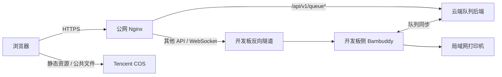

<p align="center">
  
</p>

<h1 align="center">SYSU ISE 3D Print Manager</h1>

<p align="center">
  基于 <code>Bambuddy</code> 二次开发的校园级 3D 打印平台，支持开发板侧打印机控制、云端队列兜底，以及可选的腾讯云 COS 静态资源发布。
</p>

<p align="center">
  
  
  
  
  
</p>

> [!IMPORTANT]
> 本仓库中的域名、服务器地址和 COS 地址均使用示例值。
> 实际部署时，请替换为你自己的配置。
>
> - 示例公网域名：`bambuddy.example.com`
> - 示例公网服务器：`203.0.113.10`
> - 示例 COS 地址：`https://example-bucket.cos.ap-guangzhou.myqcloud.com/BAMBUDDY/`

## 项目简介

SYSU ISE 3D Print Manager 是一个面向实验室、课程和共享创客空间的 3D 打印管理平台。
它基于 `Bambuddy` 进行二次开发，但目标不只是“能连上打印机”，而是沉淀一套真正适合多人共用、可持续运维、可直接开源部署的工程方案。

本项目重点解决一个实际问题：

- 开发板必须靠近打印机和局域网设备
- 公网入口不能随着开发板宕机一起失效
- 队列浏览、密码输入和上传登记不应该依赖开发板始终在线

因此，系统将职责拆分为三部分：

- 开发板负责打印机、摄像头和局域网设备集成
- 公网服务器负责 HTTPS、云端队列写入和故障恢复同步
- 腾讯云 COS 可选用于承载静态资源和公共文件，降低服务器压力

## 项目特性

- 打印机总览：查看状态、温度、耗材和控制入口。
- 上传登记：支持通过 MakerWorld 链接进入人工审核或排队流程。
- 云端队列兜底：即使开发板离线，用户仍可继续查看和提交队列。
- 双向队列同步：使用 `sync_uuid + updated_at + deleted_at` 进行融合。
- 模型库沉淀：支持收集、整理和复用模型资源。
- 在线切片入口：集成 Kiri:Moto，支持轻量浏览器切片。
- 直接部署：从本 GitHub 仓库即可完成部署，无需额外私有补丁包。

## 界面预览

| 打印机总览 | 实时画面 |
| --- | --- |
|  |  |

| 上传登记与队列 | 模型库 |
| --- | --- |
|  |  |

<p align="center">
  
</p>

## 架构设计



设计原则：

- 打印机控制放在开发板，避免局域网设备直接暴露到公网。
- 队列写入放在云端，避免开发板故障时“上传登记”能力消失。
- 同步范围尽量收敛，只处理必要队列数据，降低冲突和恢复成本。
- 静态资源与公共文件单独拆出，部署时可以自由选择是否接入 COS。

## 基础设施分别负责什么

| 组件 | 负责内容 | 需要配置什么 | 示例值 |
| --- | --- | --- | --- |
| 公网域名 | 用户访问入口、HTTPS 主机名、反向代理外部地址 | DNS、TLS 证书、Nginx `server_name`、外部访问 URL | `bambuddy.example.com` |
| 公网服务器 | Nginx、云端队列后端、开发板隧道入口、可选快照缓存 | 主机名或 IP、防火墙、systemd、Nginx、Python 环境 | `203.0.113.10` |
| 腾讯云 COS | 前端静态资源和公共文件分发 | Bucket、地域、`PUBLIC_FILE_BASE_URL`、`PUBLIC_FILE_UPLOAD_BASE_URL` | `https://example-bucket.cos.ap-guangzhou.myqcloud.com/BAMBUDDY/` |

如果你不需要 COS，这个项目依然可以使用服务器本地静态文件方式运行。

## 快速开始

### 1. 克隆仓库

```bash
git clone https://github.com/hiwebsun0914/SYSU_ISE_3D_Print_Manger.git
cd SYSU_ISE_3D_Print_Manger
```

### 2. 部署开发板节点

开发板负责打印机、摄像头和局域网侧集成。

- 说明文档：[board/README.md](board/README.md)
- 环境变量模板：[board/env/board.env.example](board/env/board.env.example)
- 隧道服务模板：[board/systemd/bambuddy-reverse-tunnel.service](board/systemd/bambuddy-reverse-tunnel.service)

### 3. 部署公网服务器

公网服务器负责 HTTPS、上传登记和与开发板的同步。

- 说明文档：[server/README.md](server/README.md)
- 队列环境变量：[server/env/bambuddy-queue.env.example](server/env/bambuddy-queue.env.example)
- systemd 模板：[server/systemd/bambuddy-queue.service](server/systemd/bambuddy-queue.service)
- Nginx 模板：[server/nginx/bambuddy.example.com.conf](server/nginx/bambuddy.example.com.conf)

### 4. 可选：发布静态资源到腾讯云 COS

先在本地构建前端：

```bash
cd frontend
npm ci
VITE_ASSET_BASE="https://example-bucket.cos.ap-guangzhou.myqcloud.com/BAMBUDDY/" npm run build
```

再发布到 COS：

```bash
cd ..
COS_BASE_URL="https://example-bucket.cos.ap-guangzhou.myqcloud.com/BAMBUDDY/" \
  scripts/publish_static_to_cos.sh
```

随后将以下变量指向你自己的 COS 地址：

- `PUBLIC_FILE_BASE_URL`
- `PUBLIC_FILE_UPLOAD_BASE_URL`

## 仓库结构

```text
.
├── backend/                # 共享后端源码
├── frontend/               # 共享前端源码
├── spoolbuddy/             # 打印耗材和外设相关服务
├── scripts/                # 构建、部署和维护脚本
├── board/                  # 开发板部署文档与模板
├── server/                 # 公网服务器部署文档与模板
├── deploy/                 # 其他部署资产，如公共代理方案
├── Picture/                # 原始截图素材
└── docs/images/            # README 使用的整理后截图
```

说明：

- `backend/`、`frontend/`、`spoolbuddy/` 是开发板和服务器共用的源码。
- `board/` 与 `server/` 专门存放角色化部署说明和模板。
- 运行时数据库、构建产物、日志和缓存默认不纳入 Git 跟踪。

## 本地开发

### 后端

```bash
python -m venv .venv
source .venv/bin/activate
pip install -r requirements.txt
pytest backend/tests/unit
```

### 前端

```bash
cd frontend
npm ci
npm run dev
```

默认情况下，前端生产构建产物会输出到仓库根目录的 `static/`。
这个目录应视为部署时生成内容，而不是 Git 版本内容。

## 部署文档入口

- [board/README.md](board/README.md)：开发板部署、反向隧道与同步配置
- [server/README.md](server/README.md)：公网服务器、云端队列后端与 Nginx 配置
- [deploy/public_proxy/README.md](deploy/public_proxy/README.md)：可选的 WireGuard 与快照缓存公网代理方案

## 与上游 Bambuddy 的关系

本项目基于上游 `Bambuddy` 代码继续演化，主要增加了以下能力：

- 上传登记式队列入口
- 云端队列兜底与恢复同步
- 开发板 / 公网服务器双节点部署方案
- 腾讯云 COS 静态资源发布流程
- 面向校园和实验室场景的结构化改造

当前 README 的结构整理也参考了上游项目：

- [maziggy/bambuddy README](https://github.com/maziggy/bambuddy/blob/main/README.md)

## 许可证

本仓库许可证以根目录中的 [LICENSE](LICENSE) 为准。
