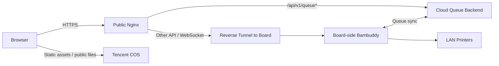

<p align="center">
  
</p>

<h1 align="center">SYSU ISE 3D Print Manager</h1>

<p align="center">
  A campus-ready 3D printing platform built on <code>Bambuddy</code>, with board-side printer control,
  cloud-backed queue resilience, and optional Tencent COS static hosting.
</p>

<p align="center">
  
  
  
  
  
</p>

> [!IMPORTANT]
> This repository uses example infrastructure values in documentation and templates.
> Replace them with your own values during deployment.
>
> - Example public domain: `bambuddy.example.com`
> - Example public server: `203.0.113.10`
> - Example COS base URL: `https://example-bucket.cos.ap-guangzhou.myqcloud.com/BAMBUDDY/`

## Overview

SYSU ISE 3D Print Manager is a secondary development project based on `Bambuddy`.
It is designed for labs, courses, and shared maker spaces that need more than a single-device dashboard.

This repository focuses on one practical problem:

- the development board should stay close to the printers
- the public website should stay available even if the board crashes
- queue browsing, password entry, and upload registration should not depend on the board being online

To make that work, the system splits responsibilities across three roles:

- the board handles printers, cameras, and LAN-only device integrations
- the cloud server handles HTTPS, public queue writes, and recovery sync
- Tencent COS can serve static assets and public files to reduce server pressure

## Highlights

- Printer dashboard for status, temperatures, consumables, and control actions.
- Upload registration flow for MakerWorld links and manual queue intake.
- Cloud-backed queue endpoints so users can still register and browse jobs when the board is offline.
- Bidirectional queue reconciliation using `sync_uuid + updated_at + deleted_at`.
- Model library workflow for collecting and reusing MakerWorld resources.
- Browser-based Kiri:Moto entry for lightweight online slicing.
- Direct deployment from this GitHub repository without extra private patch bundles.

## Screenshots

| Printer Dashboard | Live View |
| --- | --- |
|  |  |

| Queue Registration | Model Library |
| --- | --- |
|  |  |

<p align="center">
  
</p>

## Architecture



Design principles:

- Keep printer control on the board so LAN devices are never directly exposed to the Internet.
- Keep public queue writes on the cloud server so upload registration survives board outages.
- Keep synchronization narrow and explicit so recovery stays predictable.
- Keep static files optional and decoupled so deployments can choose whether to use COS.

## What Each Infrastructure Piece Does

| Component | What it is responsible for | What you need to configure | Example value |
| --- | --- | --- | --- |
| Public domain | End-user access entry, HTTPS hostname, reverse-proxy target | DNS, TLS certificate, Nginx `server_name`, external URLs | `bambuddy.example.com` |
| Public server | Public Nginx, queue backend, board tunnel endpoint, optional snapshot/cache service | Hostname or IP, firewall, systemd, Nginx, Python environment | `203.0.113.10` |
| Tencent COS | Static frontend files and optional public file hosting | Bucket, region, `PUBLIC_FILE_BASE_URL`, `PUBLIC_FILE_UPLOAD_BASE_URL` | `https://example-bucket.cos.ap-guangzhou.myqcloud.com/BAMBUDDY/` |

If you do not need COS, the project can still run with server-hosted static files.

## Quick Start

### 1. Clone the repository

```bash
git clone https://github.com/hiwebsun0914/SYSU_ISE_3D_Print_Manger.git
cd SYSU_ISE_3D_Print_Manger
```

### 2. Deploy the board node

The board is responsible for printers, cameras, and LAN-side integrations.

- Guide: [board/README.md](board/README.md)
- Template env: [board/env/board.env.example](board/env/board.env.example)
- Tunnel service: [board/systemd/bambuddy-reverse-tunnel.service](board/systemd/bambuddy-reverse-tunnel.service)

### 3. Deploy the public server

The server is responsible for HTTPS, public queue writes, and synchronization with the board.

- Guide: [server/README.md](server/README.md)
- Queue env: [server/env/bambuddy-queue.env.example](server/env/bambuddy-queue.env.example)
- Systemd: [server/systemd/bambuddy-queue.service](server/systemd/bambuddy-queue.service)
- Nginx: [server/nginx/bambuddy.example.com.conf](server/nginx/bambuddy.example.com.conf)

### 4. Optionally publish static assets to Tencent COS

Build the frontend locally:

```bash
cd frontend
npm ci
VITE_ASSET_BASE="https://example-bucket.cos.ap-guangzhou.myqcloud.com/BAMBUDDY/" npm run build
```

Publish to COS:

```bash
cd ..
COS_BASE_URL="https://example-bucket.cos.ap-guangzhou.myqcloud.com/BAMBUDDY/" \
  scripts/publish_static_to_cos.sh
```

Then point:

- `PUBLIC_FILE_BASE_URL` to the public read URL
- `PUBLIC_FILE_UPLOAD_BASE_URL` to the upload URL or the same bucket base

## Repository Layout

```text
.
├── backend/                # Shared backend source
├── frontend/               # Shared frontend source
├── spoolbuddy/             # Printer spool and accessory services
├── scripts/                # Build, deploy, and maintenance scripts
├── board/                  # Board-side deployment docs and templates
├── server/                 # Public server deployment docs and templates
├── deploy/                 # Extra deployment assets such as public proxy helpers
├── Picture/                # Original project screenshots
└── docs/images/            # README-ready image copies
```

Notes:

- `backend/`, `frontend/`, and `spoolbuddy/` are shared across board and server roles.
- `board/` and `server/` contain role-specific deployment guides and config templates.
- Runtime databases, build outputs, logs, and caches are intentionally excluded from Git.

## Development

### Backend

```bash
python -m venv .venv
source .venv/bin/activate
pip install -r requirements.txt
pytest backend/tests/unit
```

### Frontend

```bash
cd frontend
npm ci
npm run dev
```

By default, frontend production builds are written to the repository root `static/` directory.
That directory is meant to be generated during deployment rather than versioned in Git.

## Deployment Docs

- [board/README.md](board/README.md): board-side deployment and reverse-tunnel setup
- [server/README.md](server/README.md): public server, queue backend, and Nginx setup
- [deploy/public_proxy/README.md](deploy/public_proxy/README.md): optional WireGuard and cache-snapshot public proxy pattern

## Relationship to Upstream Bambuddy

This project builds on the upstream `Bambuddy` codebase and adapts it for shared-campus operations.
The main additions in this repository are:

- upload registration workflow for queue intake
- cloud-backed queue resilience
- board and public-server split deployment
- Tencent COS publishing workflow
- campus-oriented branding and operational structure

The upstream project that inspired this repository structure and presentation is:

- [maziggy/bambuddy README](https://github.com/maziggy/bambuddy/blob/main/README.md)

## License

This repository follows the license defined in [LICENSE](LICENSE).
