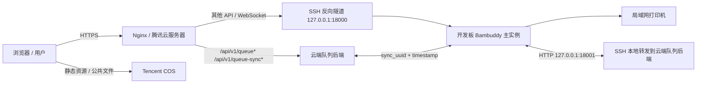
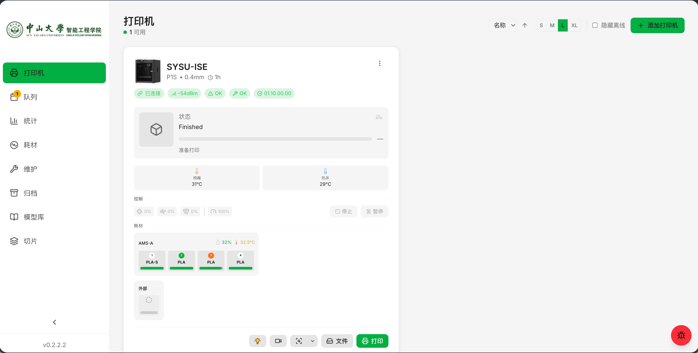
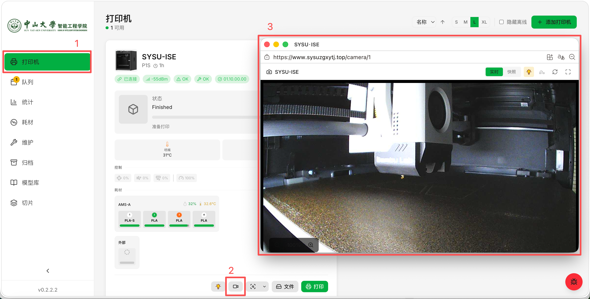
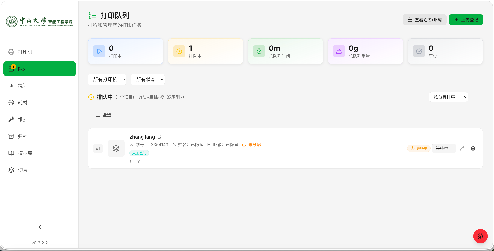
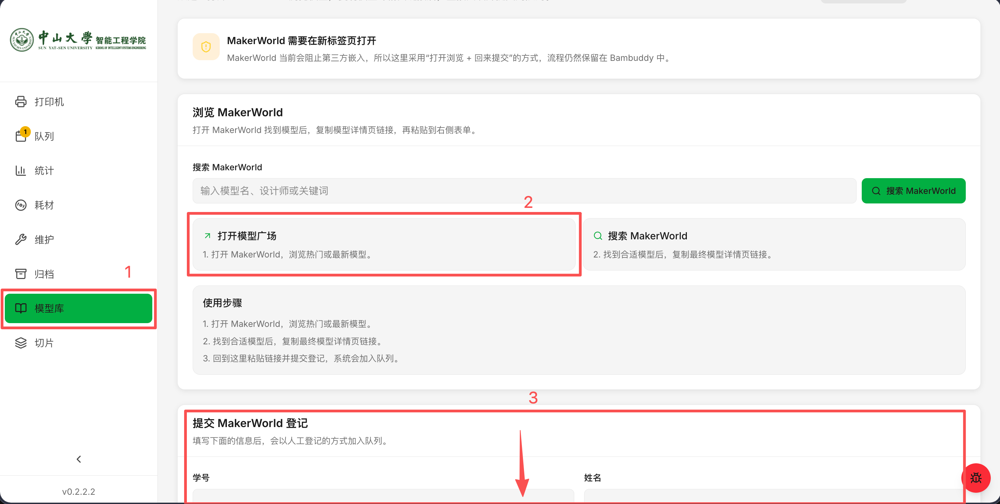
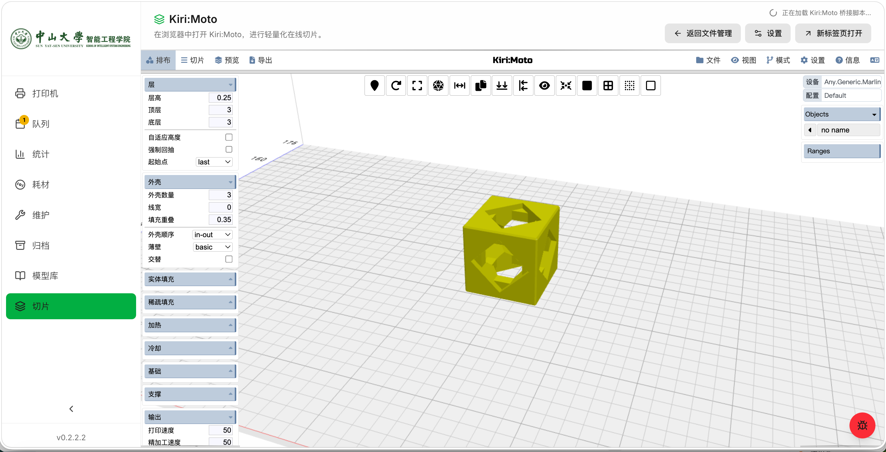

# SYSU ISE 3D Print Manager

中山大学智能工程学院 3D 打印平台项目，基于 `Bambuddy` 二次开发，面向实验室和课程场景提供打印机管理、模型库、在线切片、队列排队与云端兜底能力。

本项目的核心目标不是单纯“能打印”，而是把一套真实可运维的校园 3D 打印平台沉淀为可复用的开源工程：

- 开发板负责连接局域网内打印机、摄像头和本地设备
- 腾讯云服务器负责公网访问、HTTPS、队列兜底和同步
- 腾讯云 COS 负责静态资源与公共文件分发
- 即使开发板卡死，前端仍然可以输入密码查看队列、上传登记和继续提交队列

## 平台概览

| 项目 | 当前实例 |
| --- | --- |
| 公网域名 | `https://sysuzgxytj.top` |
| 腾讯云服务器 | `43.160.198.64` |
| COS 地址 | `https://sysuzngcxy-1322240898.cos.ap-guangzhou.myqcloud.com` |
| 队列策略 | 云端写入、双向同步、时间戳融合 |
| 典型终端 | Bambu Lab 打印机、开发板、浏览器前端 |

## 核心能力

- 打印机总览：统一查看打印机状态、温度、耗材、控制按钮和实时连接状态。
- 上传登记：用户可以通过队列页提交 MakerWorld 模型链接，以“上传登记”的方式进入人工审核/排队流程。
- 队列韧性：公网 `/api/v1/queue*` 由云端队列后端兜底，开发板宕机时仍可继续登记和查看。
- 双向同步：开发板与云端使用 `sync_uuid + updated_at + deleted_at` 做队列融合，支持恢复后自动补同步。
- 模型库：支持浏览 MakerWorld、回填链接、沉淀模型条目与后续排队。
- 在线切片：集成 Kiri:Moto，支持在浏览器中完成轻量切片。
- COS 发布：支持将前端静态资源和公共文件上传到腾讯云 COS，便于公网分发。

## 系统架构



架构设计原则：

- 打印机控制链路留在开发板，避免公网直接接触局域网设备。
- 队列写入链路留在云端，避免开发板宕机时整个平台失去“上传登记”能力。
- 静态资源和公共文件可走 COS，减轻云服务器带宽与回源压力。
- 开发板与云端只同步“手动登记队列”，减少冲突面并降低恢复成本。

## 界面预览

### 打印机总览



### 打印机实时画面



### 上传登记与队列页



### 模型库登记



### 在线切片



## 仓库结构

```text
.
├── backend/                # 共享后端源码（开发板与服务器共用）
├── frontend/               # 前端源码
├── spoolbuddy/             # SpoolBuddy 相关守护进程与脚本
├── scripts/                # 发布、同步、维护脚本
├── board/                  # 开发板部署说明与示例配置
├── server/                 # 腾讯云服务器部署说明与示例配置
├── deploy/                 # 其他部署资产（在线切片、公共代理等）
├── Picture/                # 平台截图素材
└── docs/images/            # README 使用的截图副本
```

说明：

- `backend/`、`frontend/`、`spoolbuddy/` 是共享源码，不在 `board/` / `server/` 里重复拷贝。
- `board/` 与 `server/` 专门放各自部署角色的说明、环境变量示例和 systemd / nginx 配置。
- `static/`、数据库、日志、缓存、构建产物均不建议进入 Git 仓库。

这也意味着，别人只需要克隆这一份仓库，就能直接按 `board/README.md` 与 `server/README.md` 完成双节点部署，不需要再额外索取私有脚本或补丁包。

## 部署入口

### 1. 开发板部署

开发板负责：

- 连接实验室内 Bambu 打印机
- 运行主 Bambuddy 实例
- 运行打印机控制、模型库、摄像头和本地外设逻辑
- 通过 SSH 隧道把局域网服务映射到云端

详细部署说明见：

- [board/README.md](board/README.md)

### 2. 腾讯云服务器部署

服务器负责：

- 提供公网 HTTPS 入口
- 运行云端队列后端
- 在开发板离线时继续承载“上传登记”和队列查看
- 与开发板进行双向队列同步
- 直接从本 GitHub 仓库克隆共享源码和部署模板

详细部署说明见：

- [server/README.md](server/README.md)

### 3. COS 部署

推荐将前端静态资源和公共文件发布到 COS。

典型流程：

1. 在 `frontend/` 中构建前端，输出到仓库根目录 `static/`
2. 使用 `scripts/publish_static_to_cos.sh` 上传 `static/assets`、`static/img`、`static/icons`
3. 将 `PUBLIC_FILE_BASE_URL` 与 `PUBLIC_FILE_UPLOAD_BASE_URL` 配置为 COS 地址

示例命令：

```bash
cd frontend
npm ci
VITE_ASSET_BASE="https://sysuzngcxy-1322240898.cos.ap-guangzhou.myqcloud.com/BAMBUDDY/" npm run build

cd ..
COS_BASE_URL="https://sysuzngcxy-1322240898.cos.ap-guangzhou.myqcloud.com/BAMBUDDY/" \
  scripts/publish_static_to_cos.sh
```

如果你希望 COS 同时承担公共文件访问：

- `PUBLIC_FILE_BASE_URL` 指向 COS 公共读地址
- `PUBLIC_FILE_UPLOAD_BASE_URL` 指向相同或单独的上传地址

## 开发与测试

### 后端

```bash
python -m venv .venv
source .venv/bin/activate
pip install -r requirements.txt
pytest backend/tests/unit
```

### 前端

```bash
cd frontend
npm ci
npm run dev
```

前端构建产物默认输出到仓库根目录 `static/`，该目录建议仅在部署阶段生成，不作为 Git 跟踪内容保留。

## 与上游项目的关系

本项目基于开源项目 `Bambuddy` 进行二次开发，重点加入了：

- 面向校园场景的品牌与流程调整
- “上传登记”式队列入口
- 云端队列兜底与双向同步
- COS 静态资源发布流程
- 开发板 / 服务器双节点部署方案

如果你计划继续二次开发，建议优先阅读：

- [board/README.md](board/README.md)
- [server/README.md](server/README.md)
- [deploy/public_proxy/README.md](deploy/public_proxy/README.md)

## License

许可证沿用仓库根目录中的 [LICENSE](LICENSE)。
